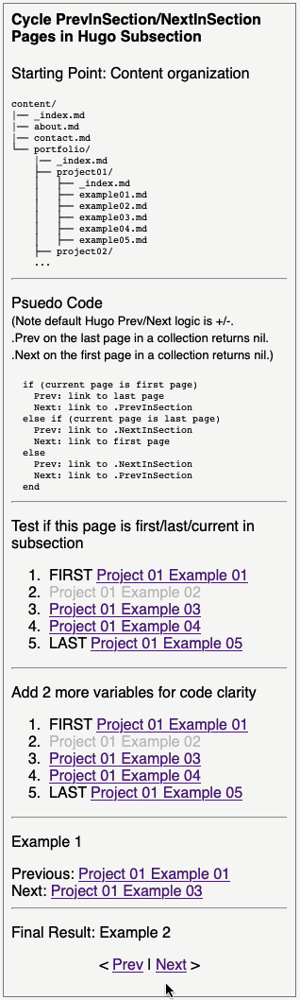

# Hugo Subsection Page Navigation with Looping Previous Next Links

Cycles from last page to first and from first page to last within a subsection page collection.

## Table of contents

- [General info](#general-info)
- [Animated screenshot](#screenshot)
- [Technologies](#technologies)

## General info

It took me awhile to figure out how to create this previous/next looping navigation pattern for a subsection in [Hugo](https://github.com/gohugoio/hugo) so I thought I'd share. This is part of a larger project converting my portfolio website to the Hugo static site generator framework from WordPress and is intended to be used as a partial such as in a sidebar area.

## Animated demo showing starting point and code organization/development process

## Technologies Used

Technology used:

- Hugo Framework (https://gohugo.io/, https://github.com/gohugoio/hugo)
- HTML
- CSS
